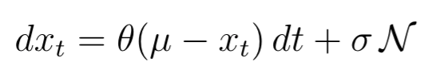
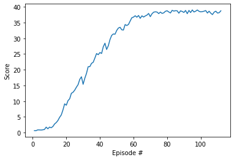
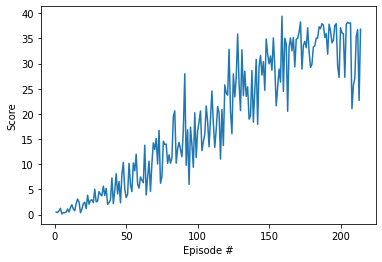

## Learning Algorithm

The network was trained with DDPG using 3-layer network for Actor with PyTorch layers:

1. Linear(33,400)
2. Linear(400,300)
3. Linear(300,4).

The input was 33 state-size input and the network returned 4 action-values.

Beside that, it was used also 3-layer Critic Network, which takes 33-states and 4-action values as input    

1. Linear(33,256)
2. Linear(256+4(actions),128)
3. Linear(128,1).

and returns the Q-value.

Also the Ornstein–Uhlenbeck process noise was added to actions values in a form.



The results are provided in ```Reacher-Solution-ddpg.ipynb```
The application can be also run with python-script ```main.py```.


Network hyperparameters used:

```
BUFFER_SIZE = int(1e6)  # replay buffer size
BATCH_SIZE = 128        # minibatch size
GAMMA = 0.99            # discount factor
TAU = 1e-3              # for soft update of target parameters
LR_ACTOR = 1e-4         # learning rate of the actor
LR_CRITIC = 1e-4        # learning rate of the critc

```


Training hyperparameters:
```
n_episodes=1000 - maximum number of training episodes
max_t=1000 -  maximum number of timesteps per episode
eps_start=1.0 - starting value of epsilon, for epsilon-greedy action selection
eps_end=0.01 - minimum value of epsilon
eps_decay=0.999 - multiplicative factor (per episode) for decreasing epsilon

```

## Progress

For 20 simultanous agents
```
Episode 1	Average Score: 0.66	Score: 0.66 eps 1.00
Episode 2	Average Score: 0.66	Score: 0.65 eps 1.00
Episode 3	Average Score: 0.73	Score: 0.89 eps 1.00
Episode 4	Average Score: 0.77	Score: 0.88 eps 1.00
Episode 5	Average Score: 0.79	Score: 0.85 eps 1.00
Episode 6	Average Score: 0.81	Score: 0.91 eps 0.99
Episode 7	Average Score: 0.84	Score: 1.03 eps 0.99
Episode 8	Average Score: 0.95	Score: 1.77 eps 0.99
Episode 9	Average Score: 0.98	Score: 1.23 eps 0.99
Episode 10	Average Score: 1.06	Score: 1.77 eps 0.99
Episode 11	Average Score: 1.11	Score: 1.58 eps 0.99
Episode 12	Average Score: 1.18	Score: 1.96 eps 0.99
Episode 13	Average Score: 1.30	Score: 2.76 eps 0.99
Episode 14	Average Score: 1.44	Score: 3.22 eps 0.99
Episode 15	Average Score: 1.60	Score: 3.87 eps 0.99
Episode 16	Average Score: 1.81	Score: 4.87 eps 0.98
Episode 17	Average Score: 2.03	Score: 5.63 eps 0.98
Episode 18	Average Score: 2.32	Score: 7.23 eps 0.98
Episode 19	Average Score: 2.68	Score: 9.17 eps 0.98
Episode 20	Average Score: 2.98	Score: 8.73 eps 0.98
Episode 21	Average Score: 3.33	Score: 10.18 eps 0.98
Episode 22	Average Score: 3.66	Score: 10.77 eps 0.98
Episode 23	Average Score: 4.05	Score: 12.51 eps 0.98
Episode 24	Average Score: 4.42	Score: 12.85 eps 0.98
Episode 25	Average Score: 4.78	Score: 13.52 eps 0.98
Episode 26	Average Score: 5.15	Score: 14.46 eps 0.97
Episode 27	Average Score: 5.53	Score: 15.27 eps 0.97
Episode 28	Average Score: 5.93	Score: 16.94 eps 0.97
Episode 29	Average Score: 6.34	Score: 17.77 eps 0.97
Episode 30	Average Score: 6.64	Score: 15.38 eps 0.97
Episode 31	Average Score: 6.99	Score: 17.28 eps 0.97
Episode 32	Average Score: 7.36	Score: 18.84 eps 0.97
Episode 33	Average Score: 7.77	Score: 20.96 eps 0.97
Episode 34	Average Score: 8.16	Score: 20.99 eps 0.97
Episode 35	Average Score: 8.55	Score: 22.03 eps 0.97
Episode 36	Average Score: 8.94	Score: 22.38 eps 0.96
Episode 37	Average Score: 9.34	Score: 23.72 eps 0.96
Episode 38	Average Score: 9.75	Score: 25.15 eps 0.96
Episode 39	Average Score: 10.14	Score: 24.79 eps 0.96
Episode 40	Average Score: 10.52	Score: 25.48 eps 0.96
Episode 41	Average Score: 10.88	Score: 25.17 eps 0.96
Episode 42	Average Score: 11.27	Score: 27.31 eps 0.96
Episode 43	Average Score: 11.67	Score: 28.44 eps 0.96
Episode 44	Average Score: 12.01	Score: 26.44 eps 0.96
Episode 45	Average Score: 12.35	Score: 27.63 eps 0.96
Episode 46	Average Score: 12.73	Score: 29.59 eps 0.96
Episode 47	Average Score: 13.12	Score: 30.92 eps 0.95
Episode 48	Average Score: 13.50	Score: 31.39 eps 0.95
Episode 49	Average Score: 13.86	Score: 31.30 eps 0.95
Episode 50	Average Score: 14.23	Score: 32.50 eps 0.95
Episode 51	Average Score: 14.61	Score: 33.26 eps 0.95
Episode 52	Average Score: 14.97	Score: 33.49 eps 0.95
Episode 53	Average Score: 15.30	Score: 32.71 eps 0.95
Episode 54	Average Score: 15.62	Score: 32.63 eps 0.95
Episode 55	Average Score: 15.96	Score: 34.37 eps 0.95
Episode 56	Average Score: 16.29	Score: 34.06 eps 0.95
Episode 57	Average Score: 16.61	Score: 34.40 eps 0.94
Episode 58	Average Score: 16.93	Score: 35.48 eps 0.94
Episode 59	Average Score: 17.26	Score: 36.53 eps 0.94
Episode 60	Average Score: 17.59	Score: 36.74 eps 0.94
Episode 61	Average Score: 17.91	Score: 37.16 eps 0.94
Episode 62	Average Score: 18.21	Score: 36.71 eps 0.94
Episode 63	Average Score: 18.51	Score: 37.25 eps 0.94
Episode 64	Average Score: 18.79	Score: 36.34 eps 0.94
Episode 65	Average Score: 19.07	Score: 37.14 eps 0.94
Episode 66	Average Score: 19.34	Score: 36.76 eps 0.94
Episode 67	Average Score: 19.61	Score: 37.10 eps 0.94
Episode 68	Average Score: 19.87	Score: 37.37 eps 0.93
Episode 69	Average Score: 20.13	Score: 37.90 eps 0.93
Episode 70	Average Score: 20.37	Score: 36.88 eps 0.93
Episode 71	Average Score: 20.62	Score: 37.79 eps 0.93
Episode 72	Average Score: 20.86	Score: 38.31 eps 0.93
Episode 73	Average Score: 21.10	Score: 38.42 eps 0.93
Episode 74	Average Score: 21.33	Score: 38.35 eps 0.93
Episode 75	Average Score: 21.55	Score: 37.85 eps 0.93
Episode 76	Average Score: 21.78	Score: 38.33 eps 0.93
Episode 77	Average Score: 21.99	Score: 37.92 eps 0.93
Episode 78	Average Score: 22.19	Score: 38.08 eps 0.92
Episode 79	Average Score: 22.40	Score: 38.59 eps 0.92
Episode 80	Average Score: 22.60	Score: 38.75 eps 0.92
Episode 81	Average Score: 22.80	Score: 38.37 eps 0.92
Episode 82	Average Score: 22.98	Score: 38.05 eps 0.92
Episode 83	Average Score: 23.18	Score: 38.89 eps 0.92
Episode 84	Average Score: 23.36	Score: 38.65 eps 0.92
Episode 85	Average Score: 23.54	Score: 38.78 eps 0.92
Episode 86	Average Score: 23.72	Score: 38.74 eps 0.92
Episode 87	Average Score: 23.88	Score: 37.97 eps 0.92
Episode 88	Average Score: 24.05	Score: 38.73 eps 0.92
Episode 89	Average Score: 24.21	Score: 38.53 eps 0.91
Episode 90	Average Score: 24.37	Score: 38.22 eps 0.91
Episode 91	Average Score: 24.53	Score: 38.85 eps 0.91
Episode 92	Average Score: 24.67	Score: 37.83 eps 0.91
Episode 93	Average Score: 24.83	Score: 38.86 eps 0.91
Episode 94	Average Score: 24.97	Score: 38.18 eps 0.91
Episode 95	Average Score: 25.12	Score: 39.02 eps 0.91
Episode 96	Average Score: 25.25	Score: 38.36 eps 0.91
Episode 97	Average Score: 25.39	Score: 38.61 eps 0.91
Episode 98	Average Score: 25.53	Score: 39.00 eps 0.91
Episode 99	Average Score: 25.66	Score: 38.59 eps 0.91
Episode 100	Average Score: 25.79	Score: 38.41 eps 0.90
Episode 101	Average Score: 26.17	Score: 38.47 eps 0.90
Episode 102	Average Score: 26.55	Score: 38.62 eps 0.90
Episode 103	Average Score: 26.93	Score: 38.82 eps 0.90
Episode 104	Average Score: 27.30	Score: 38.03 eps 0.90
Episode 105	Average Score: 27.68	Score: 38.61 eps 0.90
Episode 106	Average Score: 28.05	Score: 37.98 eps 0.90
Episode 107	Average Score: 28.41	Score: 37.53 eps 0.90
Episode 108	Average Score: 28.78	Score: 38.32 eps 0.90
Episode 109	Average Score: 29.15	Score: 38.62 eps 0.90
Episode 110	Average Score: 29.51	Score: 38.02 eps 0.90
Episode 111	Average Score: 29.88	Score: 38.14 eps 0.89
Episode 112	Average Score: 30.25	Score: 38.74 eps 0.89

Environment solved in 12 episodes!	Average Score: 30.25
```


We can see that the training for 20 agents is much more stable as for single one.

##For single agent
```
Episode 10	Average Score: 0.58	Score: 0.50 eps 0.99
Episode 20	Average Score: 1.11	Score: 2.17 eps 0.98
Episode 30	Average Score: 1.67	Score: 2.67 eps 0.97
Episode 40	Average Score: 2.29	Score: 7.27 eps 0.96
Episode 50	Average Score: 2.93	Score: 3.35 eps 0.955
Episode 60	Average Score: 3.68	Score: 7.47 eps 0.944
Episode 70	Average Score: 4.45	Score: 12.94 eps 0.93
Episode 80	Average Score: 5.39	Score: 11.86 eps 0.92
Episode 90	Average Score: 6.35	Score: 16.80 eps 0.91
Episode 100	Average Score: 7.21	Score: 16.62 eps 0.90
Episode 110	Average Score: 8.94	Score: 24.56 eps 0.90
Episode 120	Average Score: 10.63	Score: 24.12 eps 0.89
Episode 130	Average Score: 12.89	Score: 20.65 eps 0.88
Episode 140	Average Score: 14.92	Score: 24.71 eps 0.87
Episode 150	Average Score: 17.27	Score: 29.95 eps 0.86
Episode 160	Average Score: 19.43	Score: 24.48 eps 0.85
Episode 170	Average Score: 21.77	Score: 35.01 eps 0.84
Episode 180	Average Score: 23.90	Score: 29.88 eps 0.84
Episode 190	Average Score: 26.07	Score: 35.96 eps 0.83
Episode 200	Average Score: 28.02	Score: 37.12 eps 0.82
Episode 210	Average Score: 29.48	Score: 27.11 eps 0.81
Episode 214	Average Score: 30.10	Score: 36.83 eps 0.81
Environment solved in 114 episodes!	Average Score: 30.10

```



## Evaluation


The evaluation for trained is agent is above required 30.00 score in both cases:

```Episode 100	Average Score: 39.51	Score: 39.53 eps 0.00```


```Episode 100	Average Score: 38.13	Score: 39.51 eps 0.00```


## Ideas for Future Work

1. Implement PPO
2. Improve exploration using for instance: 
   [Curiosity-driven Exploration by Self-supervised Prediction](https://arxiv.org/abs/1705.05363)

