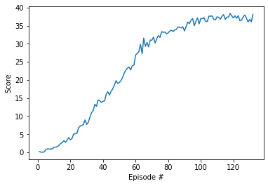

## Learning Algorithm

The network was trained with DQN using 3 layer network with PyTorch layers:

1. Linear(64,128)
2. Linear(128,64)
3. Linear(64,4).

The results are provided in ```Reacher-Solution-ddpg.ipynb```
The application can be also run with python-script ```main.py```.


Network hyperparameters:

```


```

Training hyperparameters:
```

```

## Progress

```
Episode 10	Average Score: 0.63	Score: 1.43 eps 0.99
Episode 20	Average Score: 1.66	Score: 3.47 eps 0.98
Episode 30	Average Score: 3.28	Score: 7.70 eps 0.97
Episode 40	Average Score: 5.54	Score: 14.13 eps 0.96
Episode 50	Average Score: 7.91	Score: 19.28 eps 0.95
Episode 60	Average Score: 10.42	Score: 26.89 eps 0.94
Episode 70	Average Score: 13.14	Score: 31.01 eps 0.93
Episode 80	Average Score: 15.54	Score: 33.03 eps 0.92
Episode 90	Average Score: 17.60	Score: 33.55 eps 0.91
Episode 100	Average Score: 19.44	Score: 36.97 eps 0.90
Episode 110	Average Score: 23.08	Score: 37.47 eps 0.90
Episode 120	Average Score: 26.56	Score: 37.15 eps 0.89
Episode 130	Average Score: 29.62	Score: 36.76 eps 0.88
Episode 132	Average Score: 30.18	Score: 38.16 eps 0.88
Environment solved in 32 episodes!	Average Score: 30.18
```

## Plot of Rewards




The evaluation for trained is agent is above required 13.00 score:

```Episode 100	Average Score: 14.56 eps 0.00```


## Ideas for Future Work

Add full visual raw pixels for neural network, as it will increase the agent performance, but will require longer training. 

